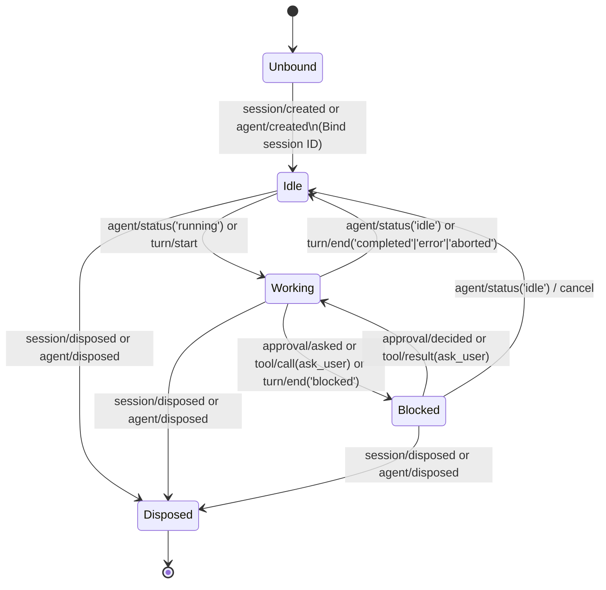

# Architecture Scout Report: DSH-to-Herdr Standalone Integration

This architectural report provides the technical design for a lightweight, standalone TypeScript plugin package connecting **DeepSeek Harness (DSH)** to **Herdr**. It inspects DSH package and plugin conventions, agent and session lifecycle events, approval and interaction hooks, process execution, failure boundaries, and testing patterns.

---

## 1. System Overview & Integration Surface

Herdr tracks pane-associated agent workloads using the environment variables `HERDR_ENV`, `HERDR_PANE_ID`, and `HERDR_BIN_PATH`.

When DSH runs inside a Herdr-managed terminal pane:
1. **Activation**: The integration activates if `HERDR_PANE_ID` and `HERDR_BIN_PATH` (and optionally `HERDR_ENV`) are set. If any required variable is missing, the plugin becomes a clean, silent no-op.
2. **Session Identity Binding**: When a root session is created or resumed, DSH reports its session identity (`sessionId`) to Herdr.
3. **State Transitions**: DSH lifecycle transitions map into four primary Herdr states:
   - `working`: Active execution (running an LLM generation step, executing tools).
   - `blocked`: Waiting for external human intervention (user approval prompt, interactive user question/clarification).
   - `idle`: Ready for user input (waiting for turn initiation or next command).
   - `disposed`: Session or agent teardown/cleanup.

---

## 2. DSH Architecture & Plugin Conventions

Based on `docs/architecture.md` and `docs/cordis-primer.md`:

- **Cordis Service / Plugin Model**: Plugins are either classes extending `Service` or objects with `apply(ctx, config)`. Service dependencies are declared via `static inject = ['agents', 'sessions']`.
- **Effects & Disposers**: Registrations use `ctx.on()` or `ctx.effect()`. Teardown is deterministic; unloading the plugin or tearing down a session unwinds event listeners cleanly.
- **Host-Plane vs Agent-Plane Composition**:
  - Session and agent lifecycles span across the host plane.
  - The Herdr reporter operates at the host plane where `ctx.sessions` and `ctx.agents` are available to observe all session creation and status changes.
- **Scope & Branded Identifiers**:
  - `SessionId` is a branded string from `@deepseek-ai/dsh-session/types` (`packages/core/session/src/types.ts:22`).
  - Agent events are dispatched with scope carriers (`@deepseek-ai/dsh-scope`), which can be observed globally or scoped to a specific agent.

---

## 3. Exact DSH Imports and Events

### 3.1 DSH Imports

```typescript
import { Context, Service } from '@deepseek-ai/cordis'
import type { Agent, AgentStatus } from '@deepseek-ai/dsh-agent'
import type { Session, SessionEvent, SessionId } from '@deepseek-ai/dsh-session'
import z from '@deepseek-ai/schemastery'
```

### 3.2 DSH Events to Subscribe

| Event Name | Source Path | Mode | Purpose & Data Payload |
|---|---|---|---|
| `session/created` | `packages/core/session/src/index.ts:54` | `emit` | Emitted when a new `Session` is entered into the store. Provides `session: Session` (`session.id`). |
| `session/disposed` | `packages/core/session/src/index.ts:64` | `emit` | Emitted when a session leaves the store. Reports `disposed` state. |
| `agent/created` | `packages/core/agent/src/runtime-types.ts:159` | `emit` | Emitted when an `Agent` instance is published. Confirms active root agent binding. |
| `agent/status` | `packages/core/agent/src/runtime-types.ts:178` | `emit` | Primary driver lifecycle trigger. Emits `{ agent, status: 'idle' \| 'running' }`. |
| `session/event` | `packages/core/session/src/index.ts:76` | `emit` | Feed of all appended session log events: |
| ↳ `approval/asked` | `packages/interaction/user-approval/src/index.ts:44` | log event | Indicates the agent is paused waiting for user approval decision -> triggers `blocked`. |
| ↳ `approval/decided` | `packages/interaction/user-approval/src/index.ts:55` | log event | User approval resolved -> returns to `working` (if driver status is `running`). |
| ↳ `tool/call` (`ask_user` / `ask_user_question`) | `packages/core/session/src/types.ts:283` | log event | Model invoked human-in-the-loop clarification question -> triggers `blocked`. |
| ↳ `tool/result` | `packages/core/session/src/types.ts:295` | log event | Question answered / tool concluded -> unblocks state. |
| ↳ `turn/end` | `packages/core/session/src/types.ts:252` | log event | Turn completed with `reason: TurnEndReason`. If `reason.kind === 'blocked'`, transitions to `blocked`; otherwise when status flips to `idle`, transitions to `idle`. |

---

## 4. Event-to-State Mapping Logic



### State Priority & Disambiguation Rules:
1. **Root Agent Scope**: Subagents spawned via `tool-subagent` inherit or share the session store (`packages/core/agent/src/index.ts:588`). The Herdr reporter filters by root session/agent (`ctx.agents.roots().includes(agent)` or `header.origin !== 'subagent'`) so subagent turns do not flap the pane's state.
2. **Blocked vs Working**:
   - When an `approval/asked` event or `ask_user` tool call is emitted, state immediately transitions to `blocked` even though the internal driver status is technically `running`.
   - When `approval/decided` or the matching `tool/result` arrives, state returns to `working` (if `agent.status === 'running'`) or `idle`.
3. **Sequential State Queue**: To prevent out-of-order execution of child processes, reports for a pane are queued sequentially using a FIFO promise chain per session.

---

## 5. Execution & Failure Behavior

1. **Environment Detection**:
   ```typescript
   const paneId = process.env.HERDR_PANE_ID
   const binPath = process.env.HERDR_BIN_PATH || 'herdr'
   const herdrEnv = process.env.HERDR_ENV
   const enabled = Boolean(paneId && (herdrEnv || process.env.HERDR_BIN_PATH))
   ```
2. **Subprocess Dispatch**:
   - Use `node:child_process.execFile` (or `spawn`) with detached stdio (`stdio: 'ignore'`) and a strict execution timeout (e.g. 2000ms).
   - Execution command pattern:
     - Identity / Bind: `${binPath} pane set-session --pane "${paneId}" --session "${sessionId}"`
     - State Report: `${binPath} pane report --pane "${paneId}" --state "${state}"`
3. **Failure Isolation (Fail-Open / Non-Blocking)**:
   - All reporting is strictly non-blocking (fire-and-forget relative to the DSH agent loop).
   - Any failure (binary not found, non-zero exit code, timeout) is caught, logged to `ctx.logger.debug`/`warn`, and swallowed without rethrowing.
   - DSH agent operation must never fail or stall due to Herdr reporting issues.

---

## 6. Standalone Package & Test Structure

### 6.1 Recommended File Structure

```
packages/herdr/
├── package.json
├── tsconfig.json
├── tsdown.config.ts
├── src/
│   ├── index.ts        # Cordis Plugin definition & event listeners
│   ├── reporter.ts     # Process execution & sequential reporting queue
│   ├── types.ts        # State enum, Config schema, Schemastery definition
│   └── invariant.ts    # Package invariants and assertions
└── tests/
    ├── herdr.spec.ts   # Unit & mock-event lifecycle tests
    └── reporter.spec.ts# Process execution and failure containment tests
```

### 6.2 `package.json` Shape

```json
{
  "name": "@deepseek-ai/dsh-herdr",
  "version": "0.1.0",
  "type": "module",
  "main": "./lib/index.js",
  "types": "./lib/types/index.d.ts",
  "exports": {
    ".": {
      "import": "./src/index.ts",
      "types": "./src/index.ts",
      "default": "./lib/index.js"
    }
  },
  "peerDependencies": {
    "@deepseek-ai/cordis": "workspace:*"
  },
  "dependencies": {
    "@deepseek-ai/schemastery": "workspace:*",
    "@deepseek-ai/dsh-agent": "workspace:*",
    "@deepseek-ai/dsh-session": "workspace:*"
  },
  "devDependencies": {
    "@deepseek-ai/cordis": "workspace:*",
    "vitest": "^3.0.0"
  }
}
```

### 6.3 Plugin Implementation Skeleton (`src/index.ts`)

```typescript
import { Context, Service } from '@deepseek-ai/cordis'
import z from '@deepseek-ai/schemastery'
import type { Agent } from '@deepseek-ai/dsh-agent'
import type { Session, SessionEvent } from '@deepseek-ai/dsh-session'
import { HerdrReporter } from './reporter.ts'
import type { HerdrState } from './types.ts'

export interface HerdrConfig {
  paneId?: string
  binPath?: string
  envName?: string
  enabled?: boolean
}

export const HerdrConfig: z<HerdrConfig> = z.object({
  paneId: z.string().optional(),
  binPath: z.string().optional(),
  envName: z.string().optional(),
  enabled: z.boolean().default(true),
})

export class HerdrPlugin extends Service {
  static inject = ['agents', 'sessions']
  static Config = HerdrConfig

  private reporter: HerdrReporter

  constructor(ctx: Context, config: HerdrConfig) {
    super(ctx, 'herdr')
    this.reporter = new HerdrReporter(ctx, config)

    if (!this.reporter.isEnabled()) {
      return
    }

    // 1. Session & Agent Creation -> Bind Session Identity & Set Initial State
    ctx.on('session/created', (session: Session) => {
      this.reporter.bindSession(session.id)
      this.reporter.reportState(session.id, 'idle')
    })

    // 2. Agent Status Changes -> 'running' (working) vs 'idle'
    ctx.on('agent/status', ({ agent, status }) => {
      if (status === 'running') {
        this.reporter.reportState(agent.session.id, 'working')
      } else {
        this.reporter.reportState(agent.session.id, 'idle')
      }
    })

    // 3. Granular Session Events -> 'blocked' vs 'working'
    ctx.on('session/event', (session: Session, event: SessionEvent) => {
      switch (event.type) {
        case 'approval/asked':
          this.reporter.reportState(session.id, 'blocked')
          break
        case 'approval/decided':
          this.reporter.reportState(session.id, 'working')
          break
        case 'tool/call':
          if (event.data.name === 'ask_user' || event.data.name === 'ask_user_question') {
            this.reporter.reportState(session.id, 'blocked')
          }
          break
        case 'tool/result':
          // If returning from an ask_user call, restore working state
          this.reporter.checkUnblock(session.id, event.data.message.source.callId)
          break
      }
    })

    // 4. Session / Agent Disposed
    ctx.on('session/disposed', (session: Session) => {
      this.reporter.reportState(session.id, 'disposed')
    })
  }
}

export default HerdrPlugin
```

---

## 7. Testing Strategy

Following the DSH testing patterns seen in `packages/interaction/user-approval/tests/approval.spec.ts` and `packages/session/session-telemetry-otel/tests/telemetry.spec.ts`:

1. **Unit Tests with Vitest & Mock Context**:
   - Construct a `new Context()`, mount `SessionStore`, and mount `HerdrPlugin`.
   - Mock `node:child_process.execFile` with `vi.spyOn`.
   - Assert exact arguments sent to Herdr CLI for:
     - `session/created` -> `set-session` + `report --state idle`
     - `agent/status: 'running'` -> `report --state working`
     - `approval/asked` -> `report --state blocked`
     - `approval/decided` -> `report --state working`
     - `agent/status: 'idle'` -> `report --state idle`
     - `session/disposed` -> `report --state disposed`
2. **Error Containment Tests**:
   - Simulate `execFile` throwing or timing out.
   - Verify that DSH session appends and agent driver executions proceed uninterrupted without unhandled promise rejections.
3. **Environment Guard Tests**:
   - Verify that if `HERDR_PANE_ID` is absent, no subprocess calls are made.

---

## 8. Unresolved Risks & Architectural Edge Cases

1. **Subagent Delegation Multiplexing**:
   - *Risk*: A subagent created in the same harness process emits `turn/start` and `agent/status`. If both root and subagents report to the same `HERDR_PANE_ID`, subagent completions may prematurely flip the pane to `idle` while the root agent is still `working`.
   - *Mitigation*: Track the active root session ID and ignore events originating from child sessions (`session.header.origin === 'subagent'` or non-root `ctx.agents.isOwnedBy(...)`).
2. **Cancellation & Abort Races**:
   - *Risk*: When a turn is cancelled while in `blocked` state, an `approval/decided` event with `outcome: 'cancelled'` is emitted followed immediately by `turn/end` (`aborted`) and `agent/status: 'idle'`.
   - *Mitigation*: The FIFO sequential queue guarantees that `blocked` -> `idle` transitions are delivered in strict chronological order.
3. **Subprocess Spawn Overhead**:
   - *Risk*: Frequent tool calls in tight loops might spawn many short-lived `herdr` CLI processes.
   - *Mitigation*: The reporter deduplicates identical consecutive state reports (e.g. `working` -> `working` is a no-op).
